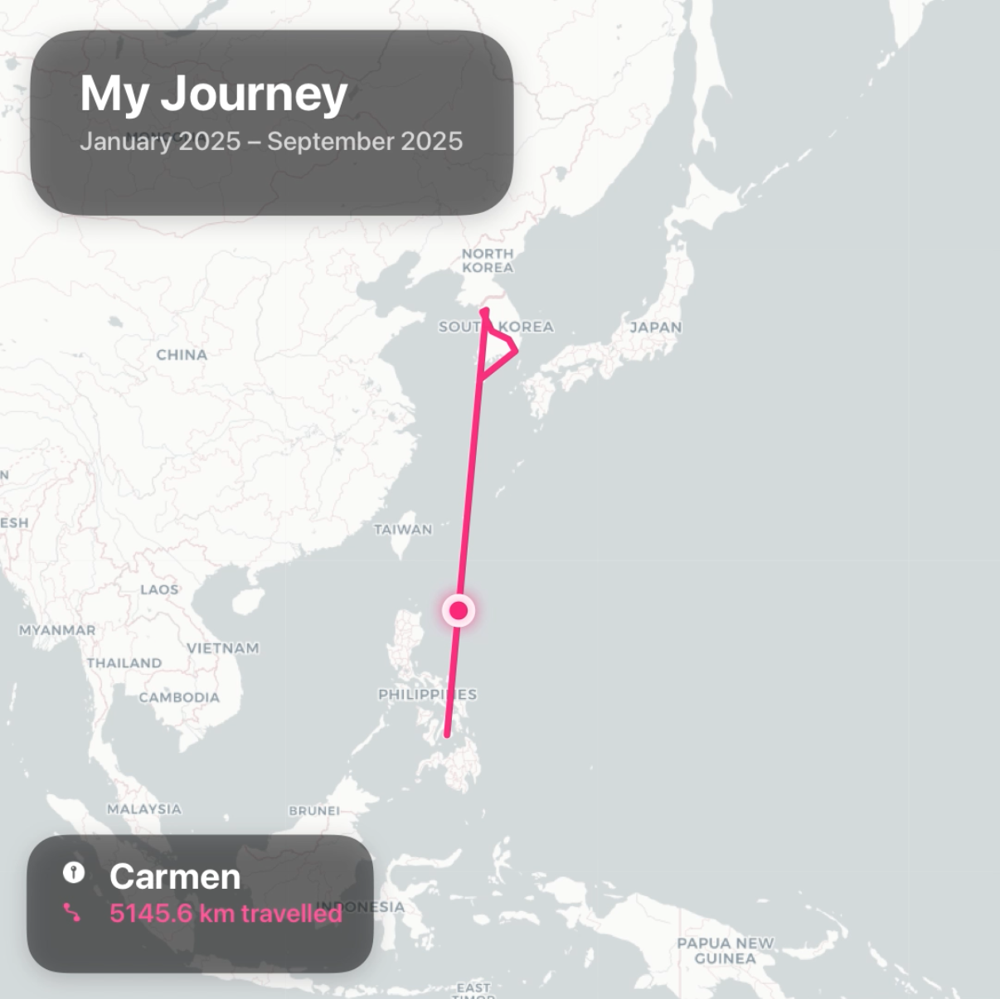
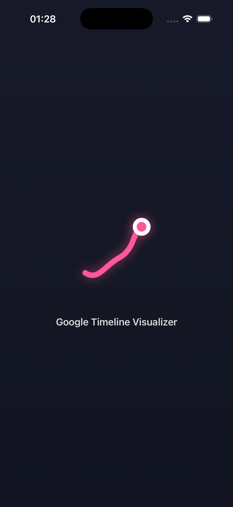
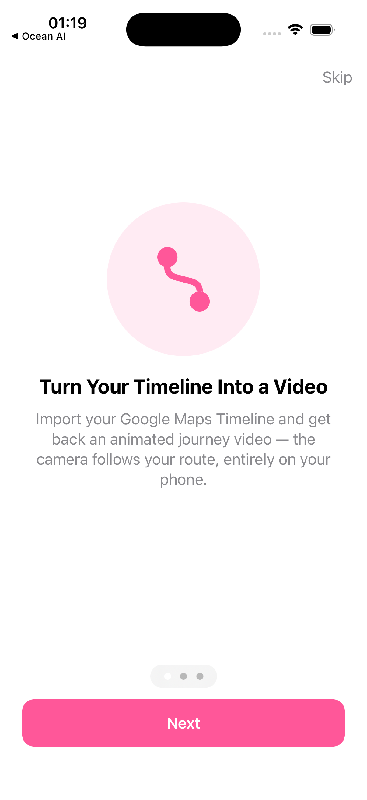
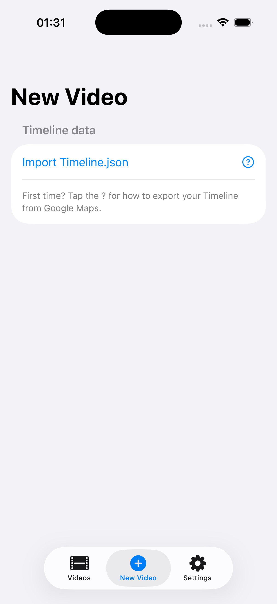
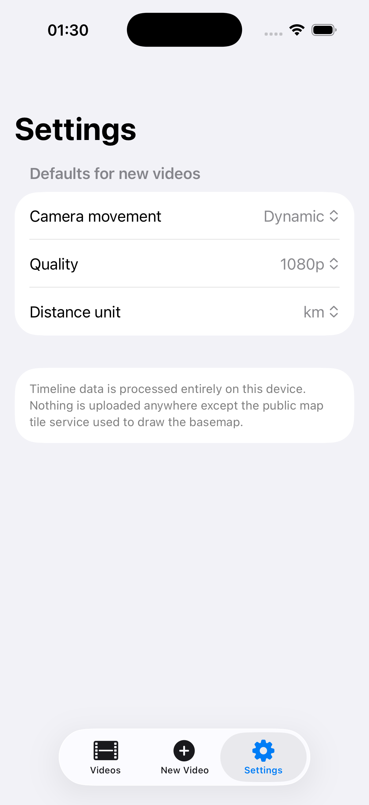

# Google Timeline Visualizer — SwiftUI

  

Turn your Google Maps Timeline into an animated travel video, entirely on your iPhone.

  

<i>A frame from an actual exported video — title card, route, and the live city / distance caption.</i>

Import your Timeline export, pick a date range, and get back an MP4 that traces your
route on a map — camera panning and zooming to follow you, city names and distance
travelled captioned live, cities visited getting their own close-up. No account,
no server, no upload: everything happens on-device.

This is a native SwiftUI/AVFoundation port of
[mahlernim/google-timeline-visualizer](https://github.com/mahlernim/google-timeline-visualizer)
(Android + web). The geo projection, camera-tracking, and Timeline JSON parsing logic
are ported from that project; the rendering and video export pipeline are rebuilt
natively with Core Graphics and AVFoundation.

## Features

- **Import** current-format Google Timeline JSON exports (`semanticSegments`)
- **Date range picker** — render any month or span of months
- **Three camera styles** — Fixed, Steady, or Dynamic (auto-zooms to follow legs of
  the trip, and zooms in tight when you're moving locally within a city)
- **Adjustable playback speed** — Slow / Normal / Fast
- **Quality presets** — 480p / 720p / 1080p
- **Live captions** — current city and running distance travelled (km or mi),
  burned into the video
- **On-device video library** — watch, share, or delete past exports
- **Nothing leaves your phone** except requests to the public basemap tile service
  (CartoDB) used to draw the map, and to Apple's geocoding service to resolve city
  names — no analytics, no account, no Google sign-in

## Screenshots

<table>
  <tr>
    <td align="center"> Splash</td>
    <td align="center"> Onboarding</td>
    <td align="center"> New Video</td>
    <td align="center"> Settings</td>
  </tr>
</table>

## Getting your Timeline JSON

The app can only work with a Timeline export **you** provide — it has no access to
your Google account. See [How to export your Timeline](#how-to-export-your-timeline)
below, or open the **?** button next to *Import Timeline.json* inside the app for
the same instructions.

### How to export your Timeline

**On iPhone or iPad:**
1. Open **Google Maps**
2. Tap your profile picture → **Settings**
3. Tap **Personal content** → **Export Timeline data**
4. Save the JSON file (e.g. to Files or iCloud Drive)
5. Open this app → **New Video** → **Import Timeline.json** and pick the file

**On Android:**
1. Open **Phone Settings → Location → Location services → Timeline**
2. Tap **Export Timeline data**, save the JSON file
3. AirDrop, email, or cloud-sync the file to your iPhone, then import it as above

If your older trips are missing, you likely need to restore a Timeline backup in
Google Maps first — see Google's own guide:
[Timeline Help for iPhone and iPad](https://support.google.com/maps/answer/6258979?hl=en&co=GENIE.Platform%3DiOS).

## How it works

- `Core/TimelineParser.swift` — parses `semanticSegments` Timeline JSON (activities,
  visits, and raw path points; all the coordinate formats Google has shipped)
- `Core/Geo.swift` — Web Mercator projection, antimeridian-safe path unwrapping,
  haversine distance
- `Core/Camera.swift` — builds a smoothed camera track: dead-zone panning, zoom
  hysteresis, and transfer-leg vs. local-leg framing so city stops get a close-up
  instead of a country-wide view
- `Core/CityLookup.swift` — sparse reverse-geocoding of waypoints along the route
- `Rendering/FrameRenderer.swift` — draws each frame (basemap tiles + route + marker
  + captions) with Core Graphics
- `Export/VideoExporter.swift` — encodes frames to MP4 with `AVAssetWriter`

## Building

Open `location-timeline-ios.xcodeproj` in Xcode 16+ and run on an iOS 17+
simulator or device. No external dependencies, no package manager — everything is
Apple frameworks (SwiftUI, AVFoundation, CoreLocation, CoreGraphics).

## Privacy

Your Timeline data is processed entirely on your device. The only network calls the
app makes are to CartoDB's public basemap tile service (to draw the map background)
and Apple's geocoding service (to resolve city names for the captions). Nothing about
your route, your account, or your device is sent anywhere else.

## Credits

Ported from [mahlernim/google-timeline-visualizer](https://github.com/mahlernim/google-timeline-visualizer).
Not affiliated with or endorsed by Google.
